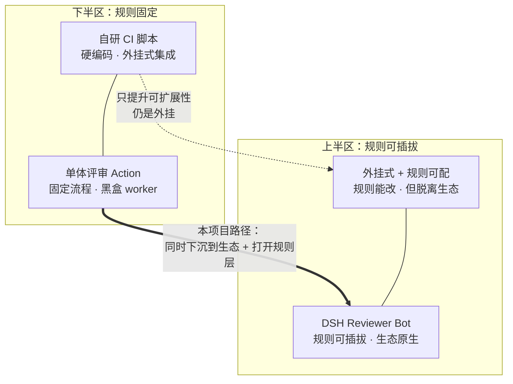

# 01 设计目标

## 产品定位

DSH Reviewer Bot 是一套长在 DeepSeek Harness 生态上的代码评审插件组。它把「评审」拆成可组合的插件,而不是一个封装好的流水线:规则、平台适配、信任判定、上报通道各自独立,能被替换和扩展。

核心命题:**确定性外壳包裹非确定性内核**。模型只负责提议,所有裁决(能否读、能否写、发到哪、发不发)由控制器按可测试的规则做出。

## 目标能力

| 触发 | 行为 |
|---|---|
| PR opened / synchronize / ready_for_review | 自动评审,汇总 + 行内评论 |
| `@dsr review` | 重新评审当前变更 |
| `@dsr diagnose` | 读失败 checks/logs 定位原因 |
| `@dsr fix` | 改代码并跑校验(需 `allow-write`) |
| `@dsr rules` | 列出当前生效的规则集 |

## 安全基线

以下是**不可退让的下限**,任何后续设计不得放松。详见 [04-trust-model.md](./04-trust-model.md)。

- `pull_request_target` + 只 checkout 可信 base SHA,绝不执行 fork 代码
- 校验命令是 JSON argv 数组,不过 shell,天然免疫命令注入
- 凭据(forge token、模型 API key)在任何信任级别下都不进入 Agent 工作区
- 仓库内容、diff、日志、评论一律视为不可信输入
- 四级信任画像:fork 无仓库工具;读模式用不可变副本;写模式用去 `.git` 副本且无 shell
- `result-json` 带 `schemaVersion`,失败对象含 `code/phase/title/message/guidance/retryable`
- sticky 评论只更新预期 bot **数字 ID** 所发的评论(登录名可被改),伪造 marker 直接忽略
- 内置 watchdog,即使超时也写出 outputs

## 设计赌注

编号 B1–B8 在后续文档中被引用,作为设计决策的追溯锚点。

| 赌注 | 说明 |
|---|---|
| **B1 原生 DSH 插件** | 直接长在 Cordis 扩展点上。装进任意 DSH profile 即用,同时保留独立 Action 外壳。Docker 是写模式的可选隔离后端,不是硬依赖 |
| **B2 Forge 抽象层** | `ForgeGateway` 接口 + provider 注册表,GitHub/GitLab/Gitea 平权,不把任一平台 API 硬编码进事件路由与权限判定 |
| **B3 规则即插件** | `ctx.reviewRules.register()`,规则包独立发布安装;规则自带严重度、适用 glob、示例。规则是**声明式数据**,不含可执行回调 |
| **B4 本地 dry-run + 重放** | `dshrb review --local`、`dshrb replay <run-id>`;事件与上下文快照可存档,离线调 prompt 与规则 |
| **B5 跨 PR 记忆** | 复用 DSH 记忆上下文能力,按仓库维度记住已决议例外与累犯模式 |
| **B6 分片并行评审** | 按文件/模块切片交 `ctx.subagents` 并行,控制器合并去重,避免大 PR 截断上下文或超时 |
| **B7 常驻 Daemon 模式** | Webhook 服务端常驻,工作区与模型上下文热复用,省掉冷启动 |
| **B8 不提交 dist** | Action 外壳在 release CI 构建并附加到 release asset,源码树保持干净,降低供应链审计面 |

## 明确不做

- 不做 CI 平台通用编排器(那是 Actions/GitLab CI 自己的活)
- 不做 IDE 内联评审(DSH 生态已有面板增强类插件覆盖)
- 首版不做「从 issue 全自动开 PR」,聚焦评审/诊断/修复三件事做深

## 架构取向

两个维度定位本项目的取舍:横轴是**生态耦合度**(外挂式集成 → DSH 生态原生),纵轴是**可扩展性**(固定规则 → 可插拔规则)。本项目明确选择右上角。

| 形态 | 生态耦合度 | 可扩展性 | 代价 |
| --- | --- | --- | --- |
| 自研 CI 脚本 | 低 | 低 | 每个仓库重复造轮子 |
| 单体评审 Action | 低 | 低 | 拿不到生态扩展点,规则改不动 |
| 外挂式 + 规则可配 | 低 | 中高 | 规则可调但无法与生态内插件共享 `ctx` |
| **DSH Reviewer Bot** | **高** | **高** | 绑定 DSH 生态,需跟随其版本演进 |
