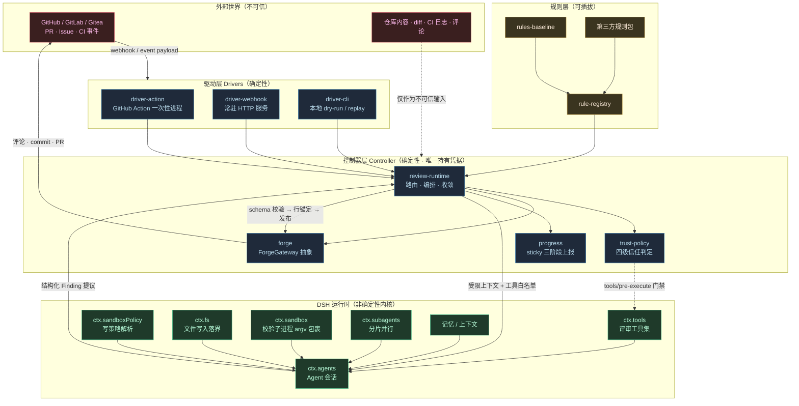
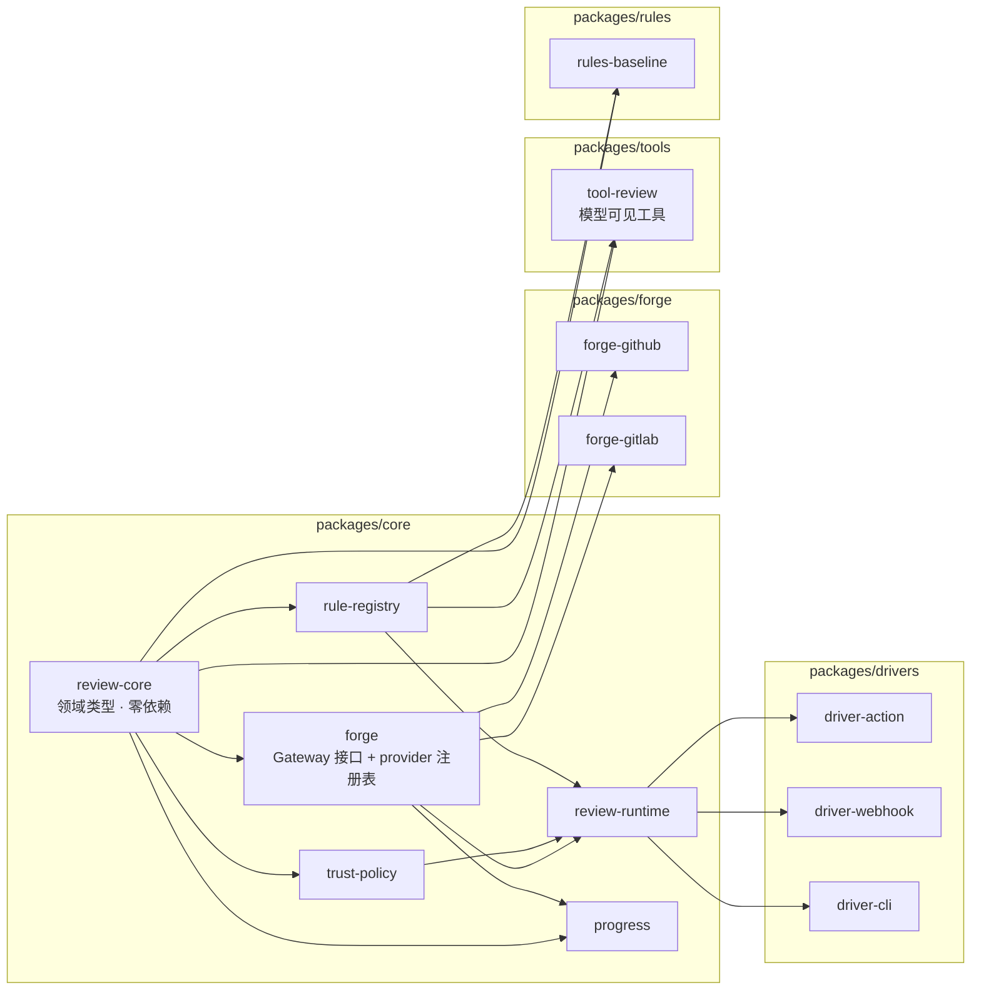

# 02 系统架构

## 分层总览

**关键分界**：控制器层与 DSH 运行时之间是**单向信任边界**。控制器向下传递受限上下文，向上只接收结构化提议；提议在跨回边界时被当作纯数据重新校验。

## 包拓扑

依赖方向严格单向：`review-core` 是无依赖的领域层，`review-runtime` 是唯一的编排汇聚点，drivers 是最外层薄壳。

## 包职责表

| 包 | 角色词 | 职责 | 不该做 |
|---|---|---|---|
| `@dshrb/review-core` | — | Finding / Verdict / TrustLevel / ReviewRequest 等领域类型与不变量 | 任何 I/O、任何平台细节 |
| `@dshrb/forge` | Gateway + Registry | `ForgeGateway` 接口定义、provider 注册与精度规则 | 具体平台 HTTP 调用 |
| `@dshrb/forge-github` | Provider | GitHub REST/GraphQL 实现 | 决定信任等级 |
| `@dshrb/forge-gitlab` | Provider | GitLab API 实现 | 同上 |
| `@dshrb/trust-policy` | Policy | actor 权限 → TrustLevel；`tools/pre-execute` 门禁 | 执行被允许的机制 |
| `@dshrb/rule-registry` | Registry | 规则包注册、glob 匹配、严重度归一 | 判断某段代码是否违规 |
| `@dshrb/rules-baseline` | — | 基线规则集（安全、正确性、可维护性） | 平台交互 |
| `@dshrb/tool-review` | — | 模型可见工具：读 diff、提 finding、提补丁、跑校验 | 直接发评论或 commit |
| `@dshrb/review-runtime` | Runtime | 路由 → 鉴权 → 上下文 → 调度 → 校验 → 发布 全流程 | 平台 API 细节、规则内容 |
| `@dshrb/progress` | Reporter | sticky 评论三阶段生命周期 | 决定评审结论 |
| `@dshrb/driver-action` | Gateway | Action inputs/outputs 适配 | 业务编排 |
| `@dshrb/driver-webhook` | Gateway | HTTP 签名校验、事件入队 | 业务编排 |
| `@dshrb/driver-cli` | Gateway | 本地 dry-run、replay、规则调试 | 业务编排 |

角色词取自 DSH 官方 [adding-a-package](https://github.com/deepseek-ai/deepseek-harness/blob/main/docs/cookbook/adding-a-package.md) 的命名约定表，保持与上游一致。

## 运行形态

```mermaid
flowchart TB
    subgraph M1["模式 A：GitHub Action"]
        A1["事件触发"] --> A2["一次性进程"] --> A3["内嵌 DSH 运行时"] --> A4["写 outputs 后退出"]
    end
    subgraph M2["模式 B：Daemon（差异化）"]
        B1["Webhook 入队"] --> B2["常驻服务"] --> B3["热复用工作区 + 上下文"] --> B4["持续消费队列"]
    end
    subgraph M3["模式 C：DSH Profile 插件（差异化）"]
        C1["dsh plugin --profile NAME add @dshrb/bundle"] --> C2["装进用户既有 profile"] --> C3["与其他生态插件共享 ctx"]
    end
    subgraph M4["模式 D：本地 CLI（差异化）"]
        D1["dshrb review --local"] --> D2["离线读本地 git diff"] --> D3["终端输出 findings"]
    end
```

四种形态共用同一个 `review-runtime`，只有驱动壳不同。这是「不给 CI 写第二套业务逻辑」的关键。

## 技术选型

| 项 | 选择 | 理由 |
|---|---|---|
| 语言 | TypeScript（strict） | 与 DSH / Cordis 生态一致 |
| 包管理 | pnpm workspace | 与上游 DSH 一致（pnpm@11.x） |
| Node | 22.19+ / 24+ / 26 | 对齐 DSH engine floor |
| 配置校验 | `@deepseek-ai/schemastery` | DSH 插件配置的标准 Schema 实现 |
| 插件框架 | `@deepseek-ai/cordis` | peerDep + devDep 同范围（上游硬约束） |
| 测试 | vitest | 与上游一致，便于贡献者迁移 |
| 构建 | tsc + tsdown | 与上游一致 |
