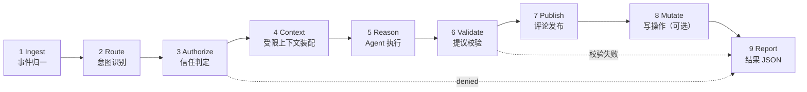
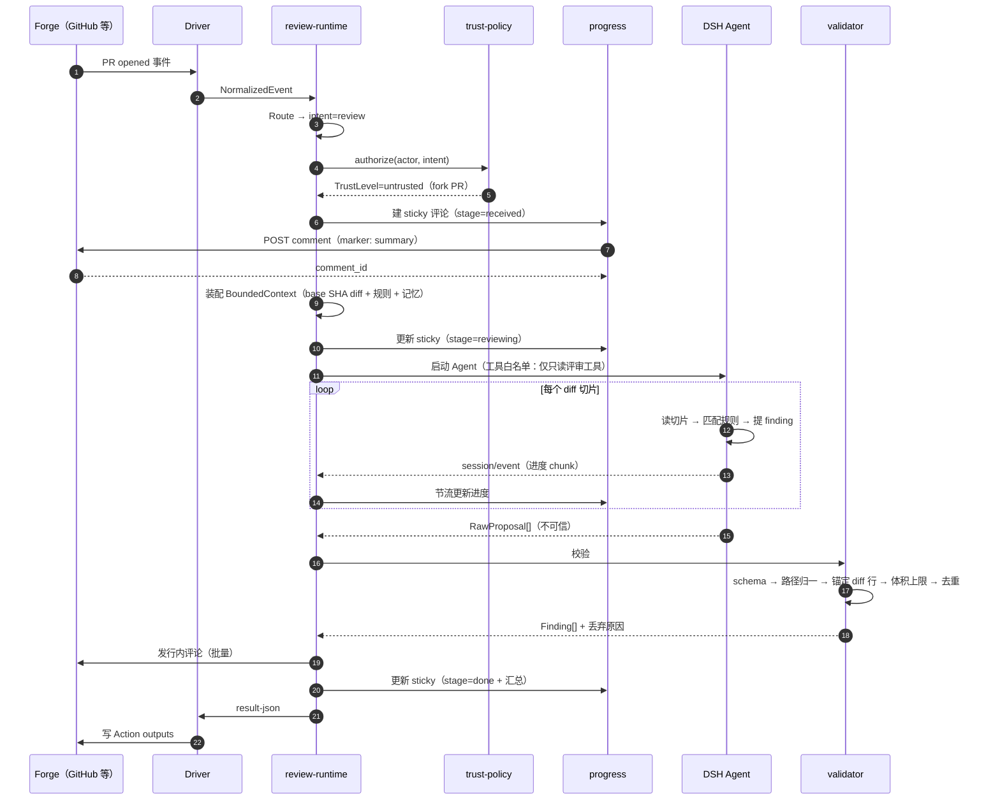
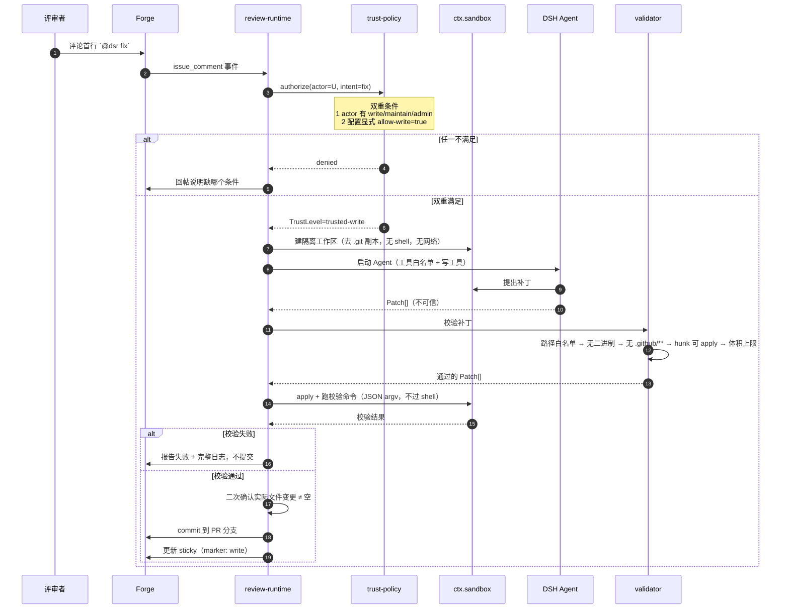
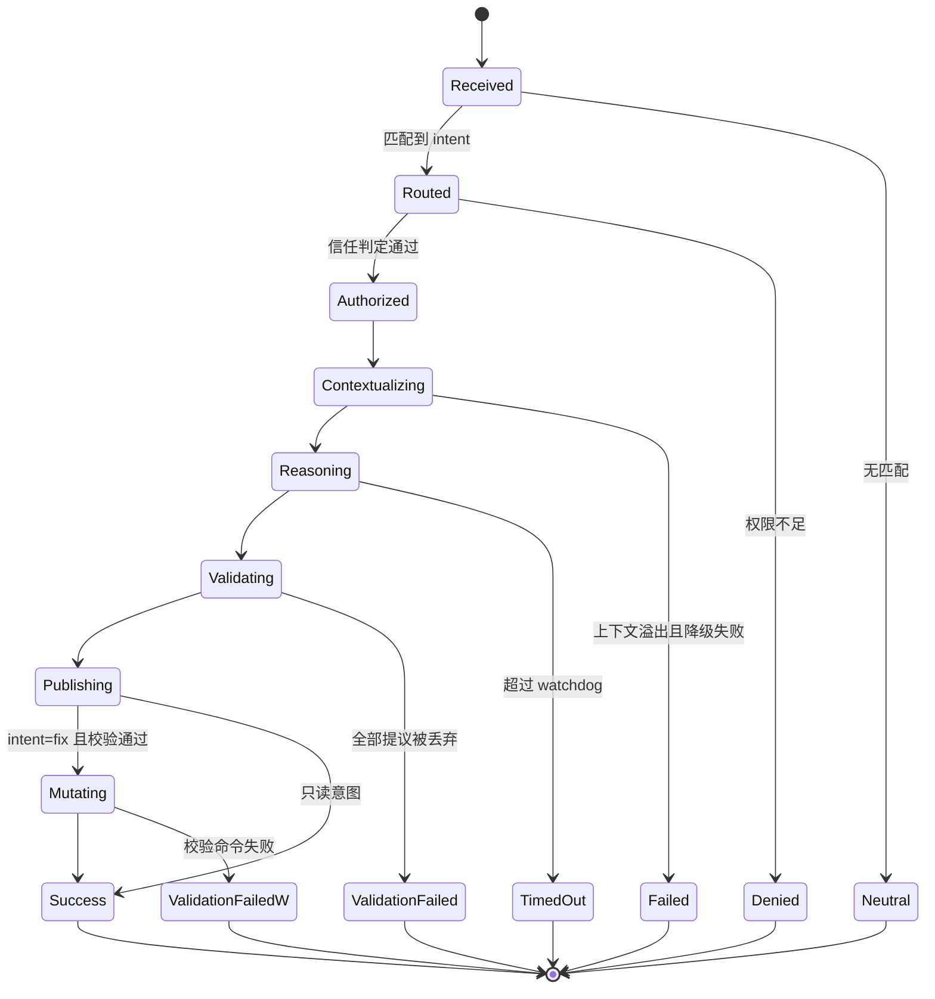
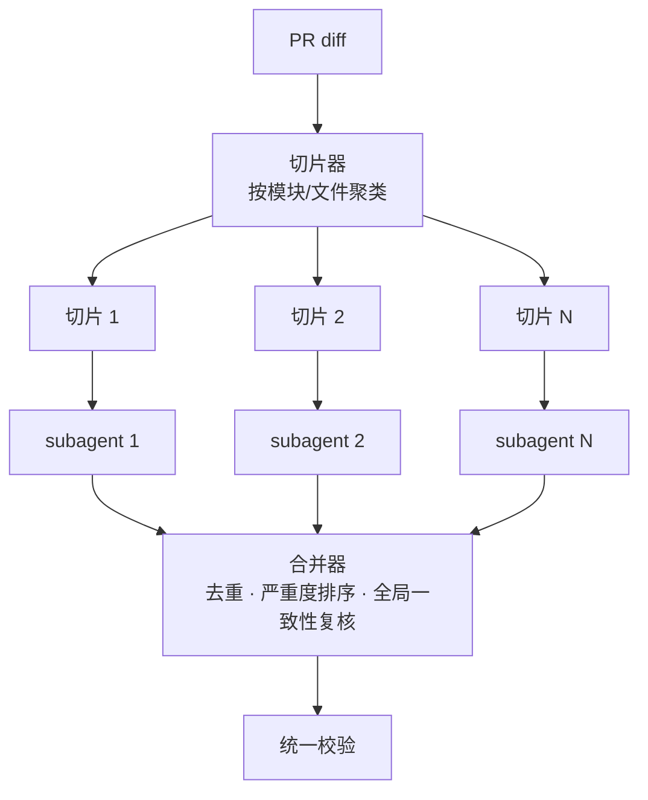

# 03 评审管线

## 八阶段管线

每个阶段是纯函数式的 `(input, deps) => Promise<output>`，阶段名进入 `result-json.failure.phase`，便于用户定位失败点。

## 阶段契约

| 阶段 | 输入 | 输出 | 失败语义 |
|---|---|---|---|
| Ingest | 平台原生 webhook / event payload | `NormalizedEvent` | `invalid_payload`，不可重试 |
| Route | `NormalizedEvent` | `ReviewIntent`（review/diagnose/fix/none） | 无匹配 → `neutral` 正常退出 |
| Authorize | `ReviewIntent` + actor 信息 | `TrustLevel` | `denied`，不可重试 |
| Context | 目标 SHA + 规则集 | `BoundedContext`（diff 切片 + 规则 + 记忆） | `context_overflow`，可重试（降级切片） |
| Reason | `BoundedContext` | `RawProposal[]`（不可信） | `model_error` / `timed_out`，可重试 |
| Validate | `RawProposal[]` | `Finding[]`（已锚定） | `validation_failed`，不可重试 |
| Publish | `Finding[]` | 评论 id 列表 + 统计 | `publish_partial`，可重试（幂等） |
| Mutate | `Patch[]` | commit sha / PR url | `write_rejected`，不可重试 |
| Report | 全阶段汇总 | `result-json` + scalar outputs | 永不失败（兜底写出） |

## 主流程时序（PR 自动评审）

**注意第 7 步**：sticky 评论在**鉴权之后、上下文装配之前**建立。这样即使后续超时，用户也能看到「已收到、正在处理」而不是静默失败。配合 watchdog，超时路径同样会写出 outputs 并更新该评论。

## 写模式时序（`@dsr fix`）

**写路径的硬红线**（`ctx.tools.guard()` 单调拒绝，后续 listener 无法翻案）：

- `.github/**`、`.gitlab-ci.yml`、任何 CI 配置 → 永久拒绝（防自我提权）
- `package.json` 的 `scripts` 字段 → 永久拒绝（防校验命令被改写）
- 任何二进制文件 → 永久拒绝
- lockfile → 仅在同一次变更也改了对应 manifest 时允许

## 意图路由表

| 触发 | intent | 最低信任 | 需 allow-write |
|---|---|---|---|
| PR opened / synchronize / ready_for_review | `review` | untrusted | 否 |
| `@dsr review` | `review` | untrusted | 否 |
| `@dsr explain <path>` | `explain` | untrusted | 否 |
| `@dsr diagnose` | `diagnose` | trusted-read | 否 |
| `@dsr fix` | `fix` | trusted-write | **是** |
| `@dsr rules` | `rules`（打印生效规则） | untrusted | 否 |
| 其它 | `none` → neutral 退出 | — | — |

命令必须出现在评论**首行**，避免用户引用他人评论时误触发。

## 状态机

终态一律写出 `result-json`；`TimedOut` 由 watchdog 保证在 job 级超时之前落盘。

## 分片并行（差异化 B6）

切片策略：优先按 import 图聚类保持语义完整，单切片超上限则按 hunk 硬切并标注「上下文被截断」，避免模型对残缺代码下强判断。合并器负责跨切片去重（同一 finding 在多个切片重复提出）与全局问题识别（如接口两侧不一致）。
