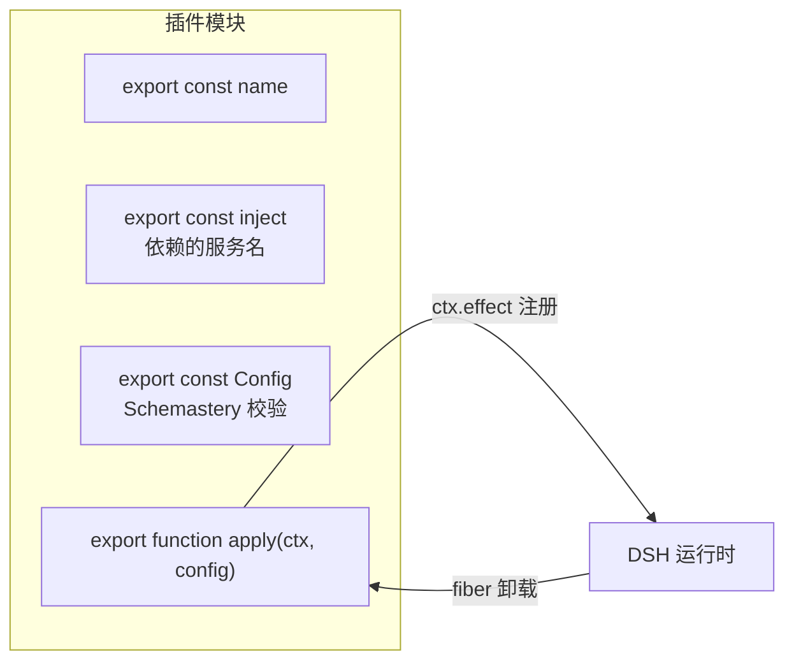
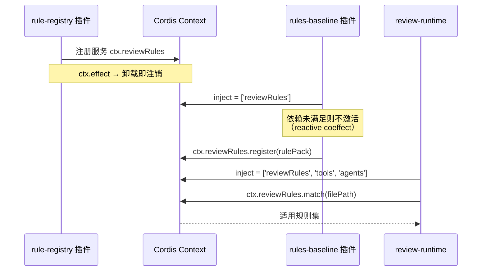
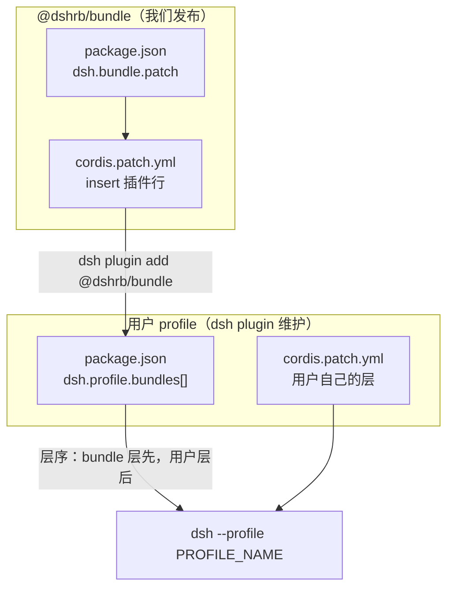
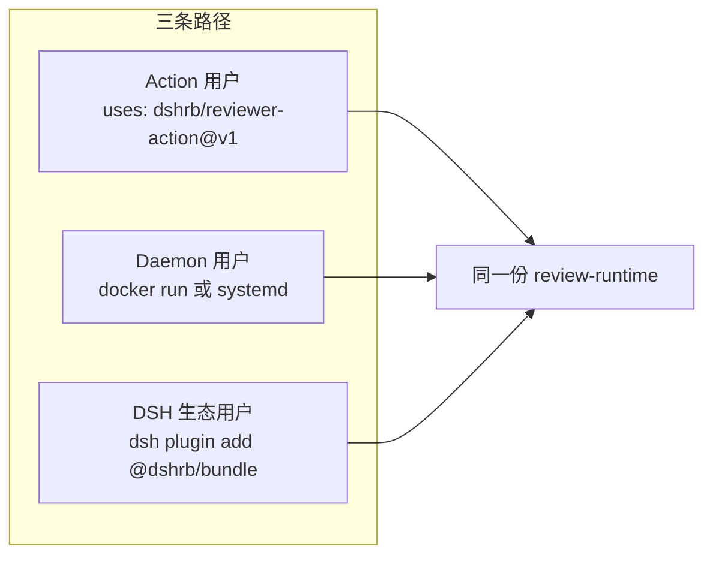
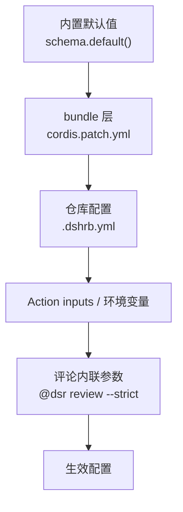

# 05 插件装配

## Cordis 扩展点映射

DSH 官方 [extension-cookbook](https://github.com/deepseek-ai/deepseek-harness/blob/main/docs/cookbook/extension-cookbook.md) 声明「每个产品特性都映射到某个文档化扩展点的 listener，没有一行修改主循环」。我们的功能同样逐项落到扩展点上：

| 我们的功能 | 使用的扩展点 |
|---|---|
| 注册评审工具（读 diff / 提 finding / 提补丁） | `ctx.tools.register()` + `defineTool()` |
| 信任门禁（allow / deny） | `ctx.on('tools/pre-execute')` 返回 `PreToolDecision` |
| 写模式硬红线（CI 配置、scripts、二进制） | `ctx.tools.guard()` 单调终局拒绝 |
| 工具可见集随信任等级收窄 | 作用域内 `ctx.tools.restrict()` 注册 |
| 评审准则 / 规则集注入 system prompt | `ctx.systemPrompt.section()`（带排序与作用域遮蔽） |
| 仓库约定（AGENTS.md 等）注入 | section provider 读文件（作为不可信数据） |
| sticky 进度上报 | `ctx.on('session/event')` 监听 `assistant/chunk` 与轮次边界 |
| 工具超时 / 重试 / 指标 | `ctx.on('tools/execute')` 包裹派发，替换 `exec.signal` |
| finding 审计与最终产出观测 | `ctx.on('tools/result')` 观测不可变终局结果 |
| 大 PR 分片并行 | `ctx.subagents` provider 注册表 |
| 跨 PR 记忆 | section provider + 记忆工具 |
| 写模式隔离（文件写入边界） | `ctx.sandboxPolicy.resolve()` 产出 `SandboxExecutionPolicy`，`ctx.fs.writeText(..., sandboxPolicy)` 按它落界 |
| 写模式隔离（校验子进程） | `ctx.sandbox.confine(argv, policy)` 把精确 argv 包进受限执行 |
| 需人工确认的高风险操作 | `tools/pre-execute` 返回 `ask` + `ctx.approval` |
| Agent 会话生命周期 | `ctx.agents` / `ctx.sessions`，收尾走 `AgentHandle.dispose()` |
| 热重载 | 所有注册都是 `ctx.effect`，卸载自动回滚 |

**没有任何一项需要 fork DSH 或修改 agent loop。** 这是 B1 赌注的技术前提。

### 写模式隔离的准确落点

实测上游 `@deepseek-ai/dsh@0.1.0-rc.6`（见 `@dshrb/signature-probe`）后，写模式隔离**不是** `ctx.sandbox` 一个后端就能表达的：

- `ctx.sandbox` 只是**进程 argv 包装器**：`confine(argv, policy): ConfinedArgv`。它把调用方即将 spawn 的精确 argv 包进受限执行，返回替换用的 argv、执行完整度与拒绝特征串。它不建 `.git` 剥离副本、不挡网络、不管 Docker。容器 / microVM / 远程执行是替换外围能力缝的**后端**，不是这个服务。
- **策略单一归属**是 `ctx.sandboxPolicy`：`defaultMode`、`workspaceRoot`、`resolve(request): SandboxExecutionPolicy`。文件落界、一次性 bash、terminal 后端读的是同一份解析结果。
- **文件写入边界**由 `ctx.fs.writeText(target, content, expected, signal, sandboxPolicy)` 落实：沙箱化 fs 后端按 `SandboxExecutionPolicy`（`mode` + `workspaceRoot`）拦界，裸后端忽略该参数。
- `SandboxMode` 只描述**文件效应**（`read-only` / `workspace-write` / `danger-full-access`）；「无网络」和「进程可见性」**不在这个词汇表内**——无网络靠「Agent 不持网络工具 + 控制器代跑网络」保证，不是靠 sandbox。
- 可选 Docker 隔离属于 **driver 层**实现（Action 模式用容器镜像），或独立扩展点，与 `ctx.sandbox` 无关。

## 插件模块形态

每个包导出标准 Cordis 插件三件套：



约束（来自上游 [config 教程](https://github.com/deepseek-ai/deepseek-harness/blob/main/docs/user/develop/basic/config.md)）：

- `Config` 必须是 Schemastery schema，**不能是普通对象**（Cordis 要求 Standard Schema 接口）
- 默认值直接写在 schema 字段上
- `@deepseek-ai/cordis` 同时进 `peerDependencies` 与 `devDependencies`，范围一致
- `@deepseek-ai/schemastery` 进 `dependencies`（运行时校验器）

## 服务注册（rule-registry 为例）

`rule-registry` 以 Cordis Service 形态注册到 `ctx.reviewRules`，供其他插件注入：



利用 Cordis 的 **reactive coeffect**：`rules-baseline` 声明 `inject: ['reviewRules']`，注册表未加载时它自动不激活，加载后自动激活——不需要手写就绪检查。

## bundle 装配

按上游 [publish 教程](https://github.com/deepseek-ai/deepseek-harness/blob/main/docs/user/develop/basic/publish.md)，bundle 是「声明 `dsh.bundle` 的 npm 包，贡献一个配置层」，profile 是「`$DSH_HOME/profiles/<name>` 下声明 `dsh.profile` 的可运行组合」。二者都用 `package.json` 描述但回答不同问题，且**没有东西同时是两者**。



我们的 `bundle/cordis.patch.yml` 按包名引用插件（不是相对路径），这样 Node 解析能找到已安装代码：

```yaml
- insert:
    - id: dshrb-rules
      name: '@dshrb/rules-baseline'
    - id: dshrb-forge-github
      name: '@dshrb/forge-github'
    - id: dshrb-runtime
      name: '@dshrb/review-runtime'
      config:
        allowWrite: false
```

用户只需一条命令即可装入既有 profile，与生态内其他插件共享同一个 `ctx`——这是 B1 的核心收益：黑盒 worker 形态拿不到生态扩展点，而插件形态可以。

## 安装路径



## 配置分层



**安全例外**：`allowWrite` 只能由 L2/L4 设置（仓库维护者控制的层）。L3 的 `.dshrb.yml` 与 L5 的评论参数**不能提升** `allowWrite`——否则 fork PR 只要在自己分支加个 `.dshrb.yml` 就能拿到写权限。这条约束在 schema 层就要标注，不能只靠代码记得。
