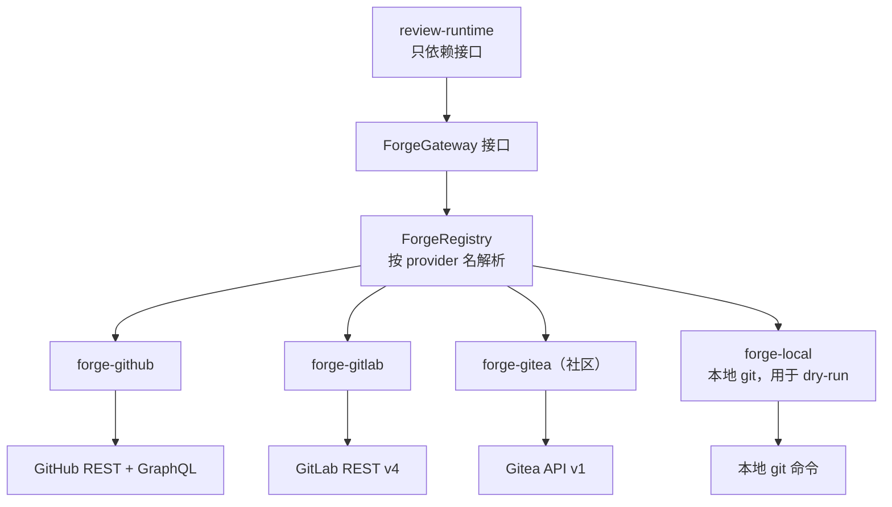
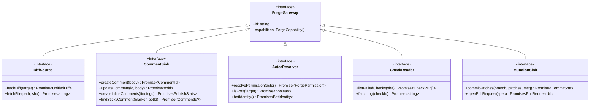
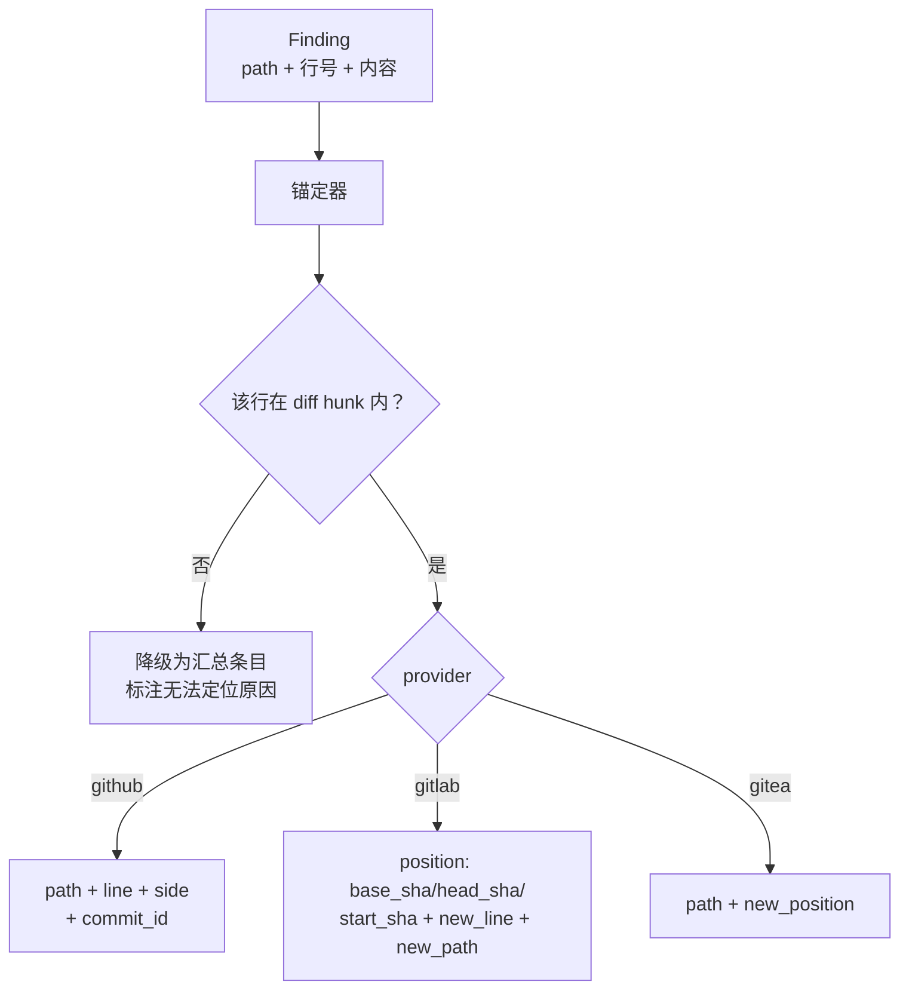
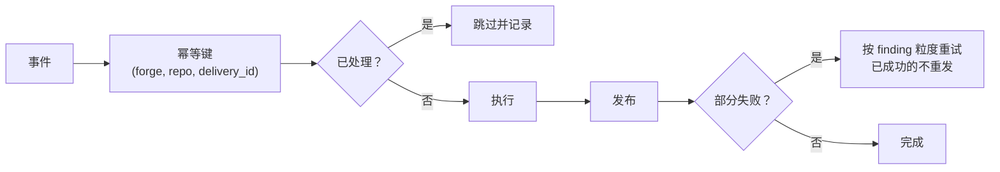

# 06 Forge 抽象

设计赌注 B2：一旦把某个平台的 API 硬编码进事件路由、评论发布与权限判定，其他平台就再无接入余地。这里用一层 `ForgeGateway` 把平台差异收敛掉，让 GitHub/GitLab/Gitea 平权。

## 接口分层

`forge-local` 是让 B4（本地 dry-run）成立的关键：把「本地仓库」也实现成一个 provider，`review-runtime` 完全不需要知道自己是在 CI 里还是在开发者笔记本上。

## 能力接口

按能力切分成多个窄接口，provider 按需实现——不强求每个平台都支持全部能力：

`review-runtime` 在启动时检查所需能力是否齐备，缺失能力导致的降级**提前显式声明**，而不是运行到一半 500。

## 能力支持矩阵

| 能力 | github | gitlab | gitea | local |
|---|---|---|---|---|
| DiffSource | ✅ | ✅ | ✅ | ✅ |
| CommentSink 汇总 | ✅ | ✅ | ✅ | ⬜ 打终端 |
| CommentSink 行内 | ✅ | ✅ | ✅ | ⬜ 打终端 |
| sticky 更新 | ✅ | ✅ | ✅ | — |
| ActorResolver | ✅ | ✅ | ✅ | ⬜ 恒为 owner |
| CheckReader | ✅ | ✅ Pipelines | ⚠️ 部分 | ❌ |
| MutationSink | ✅ | ✅ | ✅ | ⬜ 写工作区不 push |

`⬜` 表示以本地等价行为实现；`⚠️` 表示能力不完整需降级；`❌` 表示不支持，对应 intent 直接拒绝并说明原因。

## 概念归一

平台术语差异在归一层一次性抹平，领域层只认统一概念：

| 统一概念 | GitHub | GitLab | Gitea |
|---|---|---|---|
| `ChangeRequest` | Pull Request | Merge Request | Pull Request |
| `ChangeRequestId` | number | iid（注意非 id） | index |
| `Discussion` | Review Comment | Discussion / Note | Review Comment |
| `CheckRun` | Check Run / Job | Pipeline Job | Action Task |
| `Permission` | permission 字段 | access_level 数值 | permissions 对象 |
| `ForkFlag` | `head.repo.fork` | `source_project_id ≠ target_project_id` | `head.repo.fork` |

**GitLab 的 iid 陷阱值得单独记一笔**：MR 有全局 `id` 和项目内 `iid` 两个标识，评论 API 用 `iid`，而 webhook payload 里两个都有。混用会导致评论发到别的 MR 上。归一层强制只保留 `iid` 并命名为 `ChangeRequestId`，杜绝误用。

## 行内评论锚定

各平台行内评论的定位参数完全不同，这是 provider 差异最大的地方：

锚定失败**必须降级而不是丢弃**——评论落错位置比放在汇总里更糟糕，但静默丢掉一个真问题也不可接受。

## 幂等与重试

行内评论批量发布采用 per-finding 幂等键（`hash(path + anchor + ruleId)`），使重试不产生重复评论。没有这个键，`publish_partial` 失败后只能整体重跑，且重跑会刷出重复评论。

## 新增 provider 的成本

社区贡献一个新平台 provider 的完整清单：

1. 实现所需能力接口（最少 `DiffSource` + `CommentSink` + `ActorResolver`）
2. 填能力矩阵与概念归一表
3. 提供该平台的 webhook 签名校验实现
4. 过共享契约测试套件（`packages/core/forge` 导出的 provider conformance tests）
5. 声明 `dsh.bundle` 独立发布

**契约测试套件是关键**：它跑同一组用例打所有 provider，保证行为一致。没有它，多 provider 会迅速漂移成三套不同语义的实现。
