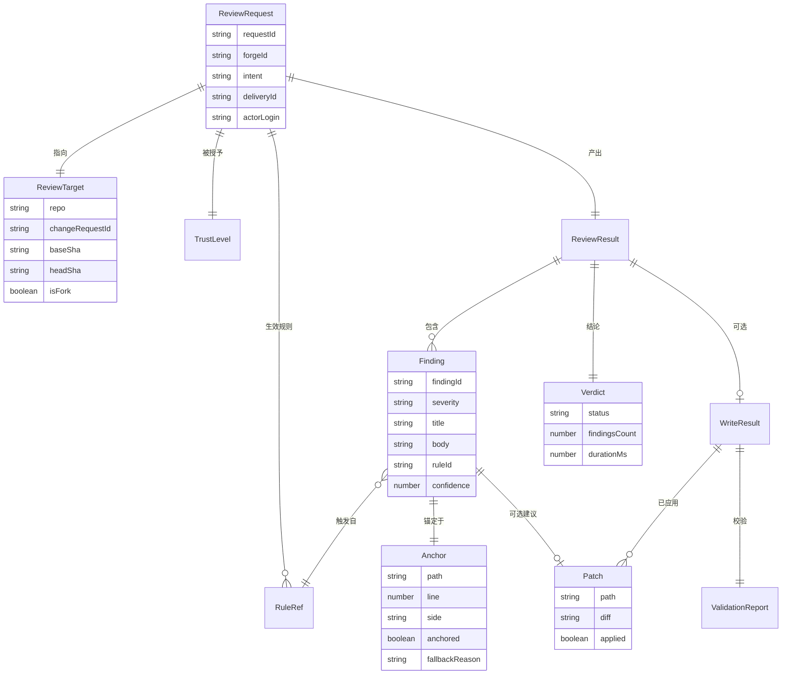
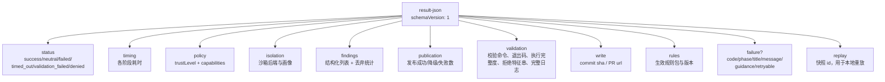
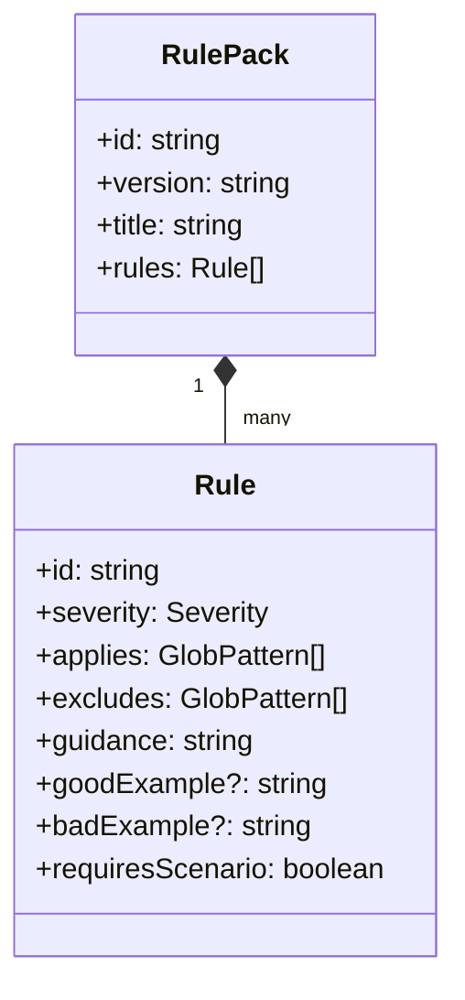
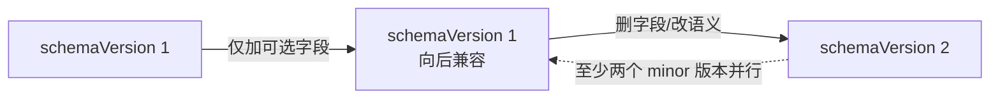

# 07 数据契约

## 核心实体



## Finding 严重度

| severity | 语义 | 是否阻塞合并 | 发布形式 |
|---|---|---|---|
| `blocker` | 明确的正确性或安全缺陷，有可复现路径 | 是 | 行内 + 汇总置顶 |
| `major` | 很可能出问题，但需人工确认前提 | 建议 | 行内 |
| `minor` | 可维护性、命名、重复 | 否 | 行内（可配置折叠） |
| `nit` | 风格偏好 | 否 | 汇总内折叠 |
| `info` | 上下文说明，非问题 | 否 | 仅汇总 |

**强约束**：`blocker` 必须带 `failureScenario`（具体输入/状态 → 错误输出或崩溃）。写不出可复现场景的一律降级为 `major`。这条规则挡住绝大部分「听起来很严重但其实是猜的」噪音。

## 收窄通道与不变量

`RawProposal → Finding` 只允许经过 **`narrowProposal`**（`packages/core/review-core`）。它是模型输出变成可发布 `Finding` 的唯一受控通道，落实 docs/README 的「模型只提议，控制器才决定」：

- **收窄返回 `Accepted | Rejected`，不抛异常**。坏提议是预期的模型行为，必须进 `ReviewResult.discarded`，而不是被当作崩溃。拒绝码（`missing-title` / `unsafe-path` / `invalid-patch` …）是 `DiscardedProposal.reason` 的机器可读前缀。
- **严重度按 rank 而非字典序**：`SEVERITY_ORDER` 是唯一排序真源；`effectiveSeverity` 落地上面的「blocker / `requiresScenario` 无场景降级」规则。
- **锚定类型收窄**：`AnchoredAnchor`（`anchored: true`，无 `fallbackReason`）与 `FallbackAnchor`（`anchored: false`，必带 `fallbackReason`）互斥，锚定失败降级而非丢弃在类型层就不可省略理由。
- **品牌化 ID 只有构造器可造**（`requestId` / `forgeId` / `commitSha` …），禁止 `as RequestId` 裸转；空值抛错，ID 来自受控代码，空即 bug。
- **`findingInvariantViolation` 是后置兜底网**：任何绕过 `narrowProposal` 进入 `Finding` 的路径（replay 快照、手工构造的测试夹具）在发布前都会再校验一次——标题/正文非空、severity 合法、`findingId` 非空、blocker 必带场景、anchor 路径安全且 `anchored` 与 `fallbackReason` 一致。
- **`findingDedupeKey` 是跨切片去重身份**（M4 分片并行）：`path \0 line \0 ruleId \0 title(trim+小写)`，用 `\0` 连接因为 `isSafeRelativePath` 已拒绝 NUL，组件内不可能伪造碰撞。注意它不同于 docs/06 的 per-finding 发布幂等键（`hash(path + anchor + ruleId)`），后者解决重试不重复发评论，前者解决多切片同一问题合并为一条。

路径安全统一走 `isSafeRelativePath`：纯语法判断，拒绝绝对路径、盘符、`..` 穿越与 NUL，不解析符号链接——符号链接落界属于 M3 sandbox 层（docs/03）。

## result-json 契约

采用带 `schemaVersion` 的信封结构，便于消费方在字段演进时做兼容判断：



信封中三个字段是本项目特有的：`findings`（结构化输出而非仅计数）、`rules`（可审计的生效规则集）、`replay`（B4 本地重放的入口）。

`validation` 字段自 M3 起如实携带校验子进程的证据，落实「被消费而非静默丢弃」的硬约束（docs/03-review-pipeline.md 写模式时序）：`enforcement`（每条命令的沙箱执行完整度 `full`/`partial`，来自 `ConfinedArgv.enforcement`）、`denials`（匹配到的拒绝特征串，来自 `ConfinedArgv.denialSignatures`）、`log`（完整合并输出，校验失败时回帖到 change request）。

**安全提醒**：`result-json` 里模型派生的字符串仍是不可信数据。下游 workflow **不得**把它们直接拼进 shell 命令。文档里必须给出正确用法：

```yaml
# 正确：走 env
- run: node scripts/notify.mjs
  env:
    SUMMARY: ${{ steps.review.outputs.summary }}
# 错误：直接插值进 shell
- run: echo "${{ steps.review.outputs.summary }}"   # 命令注入
```

## Scalar outputs

下列 output 名称属于**稳定契约**，一经发布不再重命名，只做新增。消费方可以安全地在 workflow 里直接引用：

| output | 说明 | 状态 |
|---|---|---|
| `conclusion` | success / neutral / failure | 稳定 |
| `operation` | 执行的 intent | 稳定 |
| `summary` | 汇总文本 | 稳定 |
| `review-summary` | `summary` 的向后兼容别名 | 稳定 |
| `findings-count` | finding 数量 | 稳定 |
| `branch-name` | 写模式分支名 | 稳定 |
| `pull-request-url` | 新开 PR 地址 | 稳定 |
| `commit-sha` | 写模式 commit | 稳定 |
| `trust` | untrusted/trusted-read/trusted-write/none | 稳定 |
| `duration-ms` | 总耗时 | 稳定 |
| `comment-id` | sticky 评论 id | 稳定 |
| `error-code` / `error-message` | 失败信息 | 稳定 |
| `result-json` | 版本化信封 | 稳定 |
| `blockers-count` | blocker 级 finding 数 | 新增 |
| `replay-id` | 本地重放快照 id | 新增 |
| `forge` | 平台标识 | 新增 |

outputs 在失败步骤上也写出，消费方用 `always()` + env 变量读取。

## 规则包契约

规则是**声明式数据**，不含可执行代码（见 [04-trust-model.md](./04-trust-model.md) T13）：



`requiresScenario` 让规则作者自己声明「这条规则的命中必须给出可复现场景」，把噪音控制的责任下放到规则粒度。

## 版本化策略



规则：加可选字段不升版本；删字段或改语义必须升 major 版本，并保留旧版输出至少两个 minor 版本周期。`replay` 快照单独版本化，保证老快照能被新版本读取——否则 B4 的重放能力会随每次升级失效。
