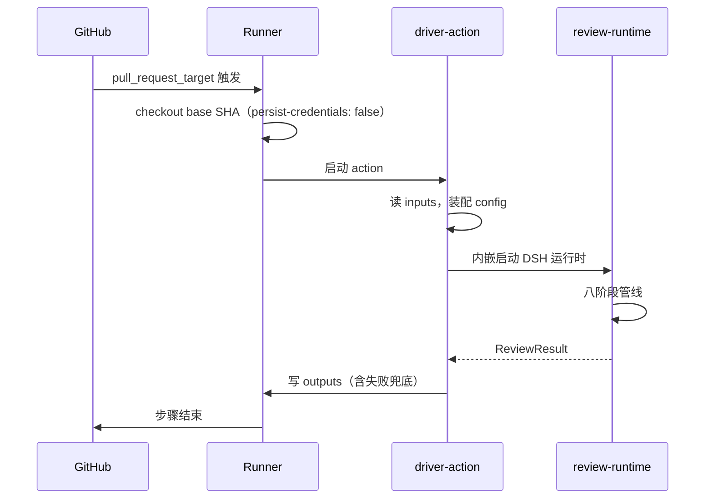
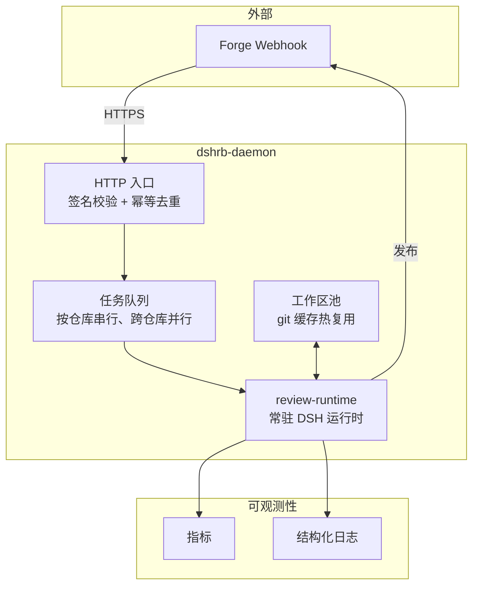
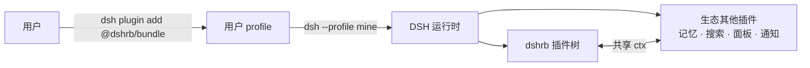
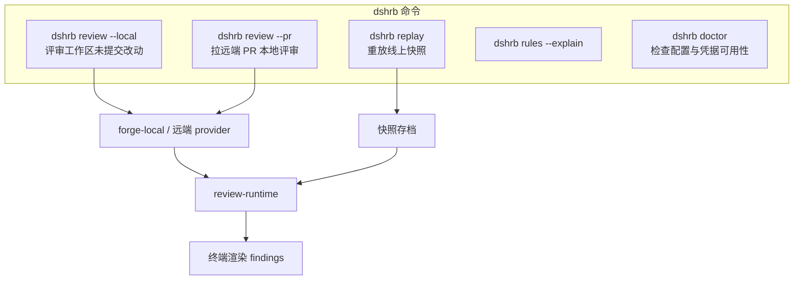
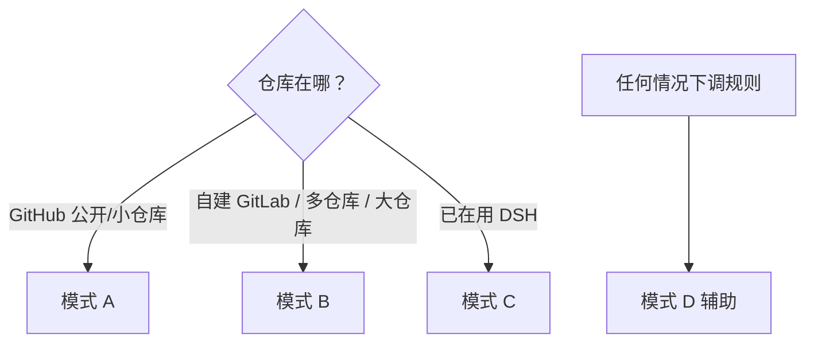

# 08 部署形态

## 模式对比

| 维度 | A: Action | B: Daemon | C: DSH Profile | D: 本地 CLI |
|---|---|---|---|---|
| 触发 | GitHub 事件 | Webhook | 用户在 DSH 里发起 | 手动命令 |
| 生命周期 | 一次性 | 常驻 | 随 DSH 会话 | 一次性 |
| 冷启动 | 每次都有 | 仅首次 | 无 | 无 |
| Docker | 写模式需要 | 可选 | 可选 | 不需要 |
| 凭据存放 | repo secrets | 服务端 env / KMS | 用户本地 | 用户本地 |
| 适合 | 尝鲜、小仓库 | 大仓库、多仓库、私有部署 | DSH 生态用户 | 规则调试 |
| 里程碑 | M1 | M4 | M4 | M2 |

## 模式 A：GitHub Action



最小 workflow：

```yaml
name: DSHRB review
on:
  pull_request_target:
    types: [opened, synchronize, ready_for_review, reopened]
permissions:
  contents: read
  pull-requests: write
jobs:
  review:
    if: github.event.pull_request.draft == false
    runs-on: ubuntu-latest
    timeout-minutes: 30
    steps:
      - uses: actions/checkout@v4
        with:
          ref: ${{ github.event.pull_request.base.sha }}
          persist-credentials: false
          fetch-depth: 1
      - uses: dshrb/reviewer-action@v1
        with:
          deepseek-api-key: ${{ secrets.DEEPSEEK_API_KEY }}
```

三个安全要点（缺一不可，文档必须解释而不只是给代码）：

1. `pull_request_target` + checkout `base.sha` —— 拿到 secrets 的同时绝不执行 fork 代码
2. `persist-credentials: false` —— 防止 token 落到 `.git/config` 被后续步骤读取
3. `timeout-minutes` 比内部 watchdog 高几分钟 —— 留出写 outputs 的时间窗

## 模式 B：Daemon（差异化 B7）



**为什么值得做**：大仓库首次 `git fetch` 就要几十秒，Action 模式每个事件都要重来一遍。Daemon 维护热工作区池，只做增量 fetch。同一仓库的任务串行以避免工作区争用，不同仓库并行。

安全注意：Daemon 是**长期持有多仓库凭据的网络服务**，攻击面显著大于一次性 Action。上线要求：

- HTTP 入口强制签名校验，校验失败不入队且不回显原因
- 凭据从 KMS/Vault 读取，不落盘、不进日志
- 每仓库工作区互相隔离，禁止跨仓库路径访问
- 队列有背压与单仓库并发上限，防止单仓库刷爆服务
- 默认不监听公网，建议置于反代之后并限制来源 IP

## 模式 C：DSH Profile 插件（差异化 B1）



这个模式的独有价值：与生态插件**共享同一个 `ctx`**。举例——用户装了飞书通知插件，评审结论能直接推到群里，我们不需要为此写任何飞书代码；用户装了记忆插件，跨 PR 记忆能力自动增强。这是插件生态的复利，外挂式集成永远拿不到。

## 模式 D：本地 CLI（差异化 B4）



`dshrb replay` 是调 prompt 与规则的核心工具：线上一次评审的完整受限上下文（含 diff 切片、规则集、记忆片段）落成快照，本地可离线重放并对比不同规则/模型配置的产出差异。没有这条通路，迭代 prompt 就只能一次次推 PR 触发 CI，反馈环极慢。

**快照的隐私边界**：快照含仓库源码片段，默认存本地，不上传。若开启远端存档，必须显式配置且文档醒目提示——这是私有代码外流的实际风险点。

## 模式选择建议


