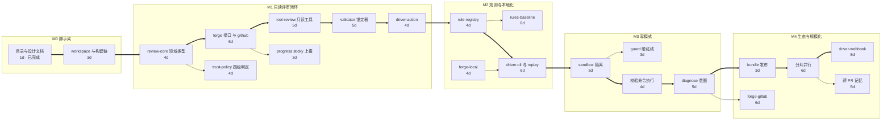

# 09 路线图

## 里程碑

依赖链（粗箭头为关键路径）：

关键路径上的 `m1g ==> m2a` 是排期顺序（M2 排在 M1 之后启动），不是技术依赖：`rule-registry` 技术上只依赖 `review-core`。

| 里程碑 | 任务 | 工期 | 依赖 | 关键路径 |
| --- | --- | --- | --- | --- |
| M0 | 目录与设计文档 | 1d | — | ✅（已完成） |
| M0 | workspace 与构建链 | 3d | 目录与设计文档 | ✅ |
| M1 | review-core 领域类型 | 4d | workspace 与构建链 | ✅ |
| M1 | forge 接口 + github | 6d | review-core | ✅ |
| M1 | trust-policy 四级判定 | 4d | review-core | |
| M1 | tool-review 只读工具 | 5d | forge + github | ✅ |
| M1 | validator 锚定器 | 5d | tool-review | ✅ |
| M1 | progress sticky 上报 | 3d | forge + github | |
| M1 | driver-action | 4d | validator | ✅ |
| M2 | rule-registry | 4d | review-core | ✅ |
| M2 | rules-baseline | 6d | rule-registry | |
| M2 | forge-local | 4d | forge 接口 | |
| M2 | driver-cli + replay | 6d | rule-registry + forge-local | ✅ |
| M3 | sandbox 隔离 | 5d | driver-cli + replay | ✅ |
| M3 | guard 硬红线 | 3d | sandbox 隔离 | |
| M3 | 校验命令执行 | 4d | sandbox 隔离 | ✅ |
| M3 | diagnose 意图 | 5d | 校验命令执行 | ✅ |
| M4 | bundle 发布 | 3d | diagnose 意图 | ✅ |
| M4 | forge-gitlab | 6d | diagnose 意图 | |
| M4 | 分片并行 | 6d | bundle 发布 | ✅ |
| M4 | driver-webhook | 8d | 分片并行 | ✅ |
| M4 | 跨 PR 记忆 | 5d | 分片并行 | |

关键路径累计 69 个工作日（起点 2026-08-15）。工期是设计阶段估算，上游版本锁定后需重估——见下方风险登记。

## 验收标准

### M1 只读评审闭环

必须全部满足才算完成：

- [ ] GitHub PR opened 事件能产出汇总评论 + 至少一条正确锚定的行内评论
- [ ] fork PR 判定为 `untrusted`，且无仓库读取工具可用（用测试断言工具白名单）
- [ ] `@dsr review` 首行触发；非首行不触发（回归测试覆盖）
- [ ] sticky 评论三阶段更新，且拒绝更新非 bot 数字 ID 所发评论
- [ ] 锚定失败降级为汇总条目并记录 `fallbackReason`，不静默丢弃
- [ ] 超时时 watchdog 仍写出完整 `result-json`
- [ ] 所有 scalar outputs 与 07-data-contracts.md 的稳定契约表逐字段一致
- [ ] 凭据不出现在 Agent 工作区（用测试扫描工作区内容断言）

### M2 规则与本地化

- [ ] 第三方规则包能被 `dsh plugin add` 安装并生效
- [ ] `dshrb review --local` 无网络无凭据可跑（用本地 git diff）
- [ ] `dshrb replay <id>` 产出与线上一致的 findings（同配置同模型下）
- [ ] `dshrb rules --explain <path>` 正确列出生效规则与来源包
- [ ] 规则包无法注册可执行回调（用负向测试断言）

### M3 写模式

- [ ] `@dsr fix` 在缺 `allow-write` 时明确拒绝并说明原因
- [ ] `@dsr fix` 在 actor 无权限时拒绝
- [ ] 试图改 `.github/**` 被 guard 永久拒绝且不可翻案
- [ ] 试图改 `package.json` 的 `scripts` 被拒绝
- [ ] 路径穿越（`../`、符号链接）被拒绝
- [ ] 校验命令走 JSON argv，不过 shell（用含 shell 元字符的路径测试）
- [ ] 校验失败不产生 commit，且完整日志回帖
- [ ] commit 前二次确认实际文件变更非空
- [ ] 校验子进程 env 走白名单（断言 secret 不可见）

### M4 生态与规模化

- [ ] `@dshrb/bundle` 可装入既有 profile 并与其他插件共享 ctx
- [ ] forge-gitlab 过完整 provider 契约测试套件
- [ ] GitLab iid/id 不混用（专项回归测试）
- [ ] 千行级 PR 分片并行完成且 finding 跨切片去重
- [ ] Daemon 模式签名校验失败不入队、不回显原因
- [ ] Daemon 单仓库并发上限与背压生效

## 风险登记

| 风险 | 等级 | 影响 | 应对 |
|---|---|---|---|
| DSH 处于 developer preview，破坏性变更频繁 | 高 | 扩展点签名变更导致插件失效 | pin 精确版本；建兼容矩阵表；扩展点用法集中在少数适配文件里，收窄改动面 |
| 上游插件 API 文档尚不完备（部分只有教程无 API 参考） | 中 | 实现时需读上游源码推断契约 | M1 期间产出内部《扩展点用法备忘》，记录实测行为与版本 |
| 行内评论锚定准确率 | 高 | 评论落错位置直接损伤信任 | 强制 hunk 内锚定 + 降级机制；锚定器高覆盖单测 |
| finding 噪音过多 | 高 | 用户关掉 bot | `blocker` 强制可复现场景；严重度可配置门槛；跨 PR 记忆识别已决议例外 |
| 模型成本 | 中 | 大仓库高频 PR 费用不可控 | 切片上限 + 单次评审 token 预算 + 可配置跳过规则（如仅评审变更文件） |
| 多 provider 行为漂移 | 中 | GitLab 用户遇到 GitHub 不存在的 bug | 共享契约测试套件为强制门禁 |
| 同类工具先做到多平台 | 中 | B2 的差异化优势被抹平 | B1/B4 的复制成本更高（需重构成插件形态 + 建快照体系），优先把这两项做深 |

## 兼容矩阵（M1 开始维护）

| dshrb | `@deepseek-ai/dsh-*` | `@deepseek-ai/cordis` | `@deepseek-ai/schemastery` | Node | 状态 |
|---|---|---|---|---|---|
| 0.1.x | 0.1.0-rc.6 | 4.0.1 | 3.18.1 | 22.19+ / 24+ | 已锁定 |

版本精确锁定（不写 range，不写 `*`）。DSH 处于 developer preview 且明确声明 rc 之间可能有破坏性变更，range 会让一次 patch 升级悄悄换掉扩展点签名。所有 `dsh-*` 包与 `@deepseek-ai/dsh` 同版本发布，统一按 `DSH` 常量走。

单一事实来源是 `scripts/gen-package-manifests.mjs` 顶部的 `CORDIS` / `SCHEMASTERY` / `DSH` 三个常量；改完重新生成，13 个 manifest 一起更新，避免逐个手改漂移。

升级流程：改常量 → `pnpm install` → `pnpm run probe`。最后一步跑 `@dshrb/signature-probe`，它在真实 Cordis 容器里验证四个我们依赖的扩展点契约仍然成立；签名变了会在这里失败，而不是在生产里静默失败。

策略：跟随上游 rc 但不追最新。当前锁在 rc.6（写作时的最新 rc）；后续升级滞后一个 rc 以规避回归。

## 运行时与部署兼容

- **GitHub Actions JavaScript 运行时**（#2）：`using: 'node24'` 已 GA。官方 metadata-syntax 文档列出 `node20`（Node v20）与 `node24`（Node v24）两种 JavaScript 运行时，`action.yml` 保持 `using: 'node24'` 即可，无需回退 node20。
- **DSH 配置层环境变量**（#2）：`cordis.patch.yml` 的配置值**不做 `$VAR` 展开**。注入环境变量要用 `!!js` 表达式（loader 在插件激活时求值，作用域含 `process` / `ctx`），例如 `token: !!js process.env.FORGE_TOKEN`；裸 `$FORGE_TOKEN` 会作为字面量字符串传给插件。`bundle/cordis.patch.yml` 已按此修正。
- **写模式隔离落点**（#1）：`ctx.sandbox` 不是隔离后端，只是 `confine(argv, policy)` 的 argv 包装器；策略单一归属 `ctx.sandboxPolicy.resolve()`，文件写入落界走 `ctx.fs.writeText(..., sandboxPolicy)`，「无网络」不在 `SandboxMode` 词汇表内，可选 Docker 属 driver 层。详见 docs/05 与 docs/03。

## 当前状态

M0 与 M1 均已完成：设计文档、workspace 与构建链（`pnpm run check` 全绿：typecheck + lint + test）就位，上游版本精确锁定（rc.6 / cordis 4.0.1 / schemastery 3.18.1）；只读评审闭环全部合入 `main`（PR #13–#19）。

M2 已完成 4/4：`rule-registry`（`reviewRules` 服务与规则包注册表，PR #29）、`rules-baseline`（基线规则包，PR #30）、`forge-local`（本地 git provider，离线 dry-run，PR #28）、`driver-cli`（`review --local` / `replay` / `rules --explain` / `doctor`，PR #31）。

已实现：`review-core` 领域类型、`forge` 接口 + 注册表 + `AnchorResolver`、`trust-policy` 四级信任判定与 `tools/pre-execute` 门禁、`forge-github` provider、`tool-review` 只读工具、`review-runtime` 八阶段管线（`ingest` / `route` / `authorize` / `assembleContext` / `reason` / `publish` / `report`，仅 `mutate` 留到 M3）、`progress` sticky 上报、`driver-action`、`rule-registry`、`rules-baseline`、`forge-local`、`driver-cli`；`@dshrb/signature-probe` 在真实容器里验证扩展点签名。共 14 个测试文件、355 例单测全绿。

未实现（刻意）：M3 的 `mutate` 阶段与 `propose_patch`、M4 的 `forge-gitlab` / `driver-webhook` 尚未实现。下一步进入 M3 写模式。
